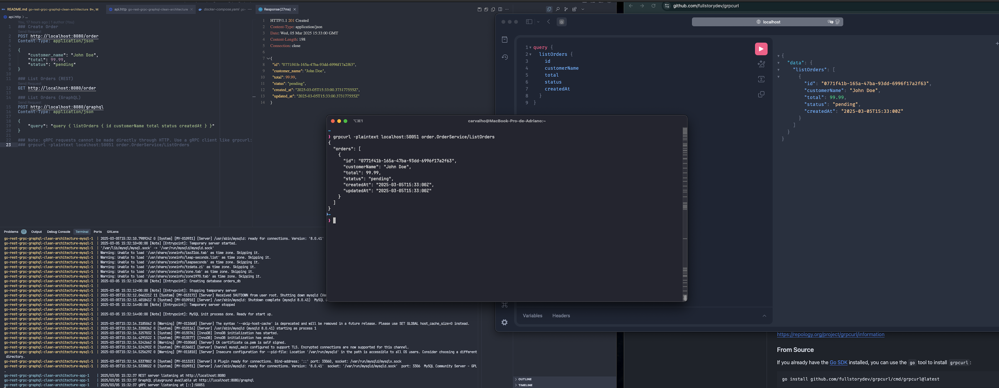

# Serviço de Pedidos com Clean Architecture

Este projeto demonstra uma implementação de Clean Architecture em Go, oferecendo um serviço de gerenciamento de pedidos através de múltiplas interfaces:

- API REST
- Serviço gRPC
- API GraphQL

## 🚀 Tecnologias Utilizadas

- Go 1.23+
- MySQL
- GORM
- gRPC
- GraphQL
- Docker
- Docker Compose

## 📋 Pré-requisitos

- Docker e Docker Compose
- Go 1.23 ou superior
- Make (opcional, para usar os comandos make)

## 🛠️ Como Iniciar

1. Clone o repositório:

```bash
git clone https://github.com/acbatista/go-rest-grpc-graphql-clean-architecture
cd go-rest-grpc-graphql-clean-architecture
```

2. Inicie a aplicação e o banco de dados usando Docker Compose:

```bash
docker compose up
```

3. A aplicação irá automaticamente:
   - Configurar o banco de dados MySQL
   - Executar as migrações necessárias
   - Iniciar todos os serviços (REST, gRPC e GraphQL)

## 📡 Portas dos Serviços

- API REST: http://localhost:8080
- gRPC: localhost:50051
- GraphQL: http://localhost:8080/graphql

## 📚 Documentação da API

### Endpoints REST

#### Listar Pedidos
```http
GET /order
```

#### Criar Pedido
```http
POST /order
Content-Type: application/json

{
    "customer_name": "João Silva",
    "total": 99.99,
    "status": "pendente"
}
```

### GraphQL

Acesse o playground GraphQL em http://localhost:8080/graphql

#### Exemplo de Consulta
```graphql
query {
  listOrders {
    id
    customerName
    total
    status
    createdAt
  }
}
```

### gRPC

O serviço gRPC está disponível na porta 50051 com os seguintes métodos:

#### Listar Pedidos
```bash
grpcurl -plaintext localhost:50051 order.OrderService/ListOrders
```

## 🏗️ Estrutura do Projeto

```
.
├── cmd/
│   └── server/          # Ponto de entrada da aplicação
├── internal/
│   ├── domain/         # Entidades e regras de negócio
│   ├── infrastructure/ # Implementações concretas (repositórios)
│   ├── interfaces/     # Adaptadores (REST, gRPC, GraphQL)
│   └── usecase/        # Casos de uso da aplicação
├── migrations/         # Migrações do banco de dados
├── proto/             # Definições dos serviços gRPC
└── graph/             # Definições e resolvers GraphQL
```

## 📊 Evidências de Execução

 


## 🧪 Testes

Para executar os testes:

```bash
go test ./...
```

## 💾 Banco de Dados

O projeto utiliza MySQL como banco de dados. A estrutura do banco é criada automaticamente através das migrações quando a aplicação é iniciada.

### Configuração do Banco de Dados

- Host: localhost
- Porta: 3306
- Usuário: root
- Senha: root
- Banco de dados: orders_db

## 🤝 Contribuindo

1. Faça um fork do projeto
2. Crie uma branch para sua feature (`git checkout -b feature/nova-feature`)
3. Faça commit das suas alterações (`git commit -am 'Adiciona nova feature'`)
4. Faça push para a branch (`git push origin feature/nova-feature`)
5. Crie um novo Pull Request

## 📝 Licença

Este projeto está sob a licença MIT. Veja o arquivo [LICENSE](LICENSE) para mais detalhes.

## 👥 Autores

- Seu Nome - [@acbatista](https://github.com/acbatista)

## 🙏 Agradecimentos

- [FullCycle - Pos- GoExpert](https://goexpert.fullcycle.com.br/pos-goexpert/)
- [Clean Architecture](https://blog.cleancoder.com/uncle-bob/2012/08/13/the-clean-architecture.html)
- [Go](https://golang.org/)
- [gRPC](https://grpc.io/)
- [GraphQL](https://graphql.org/)
